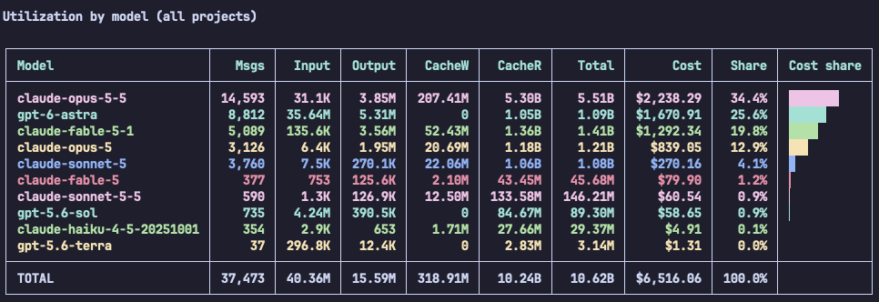

# ai-usage-report

Tokens and estimated USD cost of your AI coding sessions, per project and per model.
Reads local logs of **Claude Code** (`~/.claude/projects`) and **OpenAI Codex CLI**
(`~/.codex/sessions`). Python 3.9+, standard library only, nothing leaves your machine.

```bash
python3 usage_report.py                    # last 30 days, all projects
python3 usage_report.py --days 7 --models  # plus per-project model breakdown
python3 usage_report.py --source codex     # only Codex
python3 usage_report.py --csv out.csv --json out.json
python3 usage_report.py --pricing prices.json
```

Output: boxed, colour-coded tables with a cost-share bar: per project, per model
(all projects) and, with `--models`, model per project. Colours are used only on a
terminal (respects `NO_COLOR`).



## Pricing

Default prices are the [GitHub Copilot model pricing](https://docs.github.com/en/copilot/reference/copilot-billing/models-and-pricing)
(USD per 1M tokens, Default context tier). Long-context tiers and fast mode can't be
told apart in the logs and are priced at the Default rate. Models without a price are
marked `*` and counted as $0; add them with `--pricing`:

```json
{"claude-sonnet-5-5": {"input": 2, "output": 10, "cache_read": 0.2, "cache_write_5m": 2.5}}
```

Costs are list-price estimates, not billing.

## License

MIT
